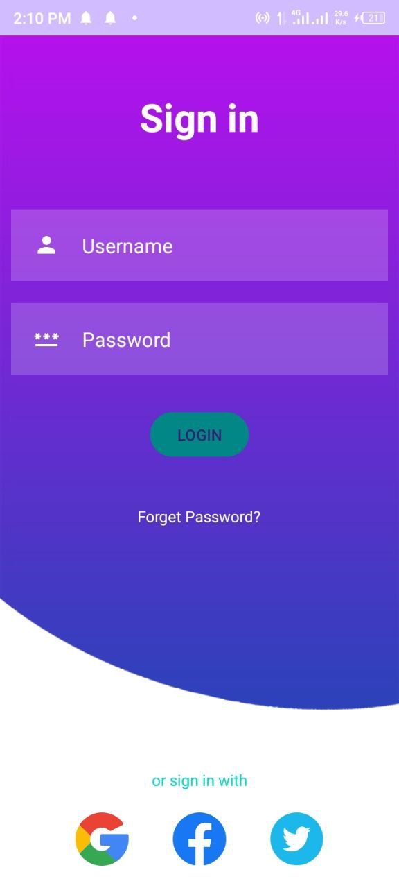

# Simple Login App



## Overview

This is a simple Android app that demonstrates user input handling and validation through a basic login page. The app allows users to input their credentials and validates the input.

## Features

- User-friendly and intuitive login interface.
- Minimalist design for streamlined user experience.

## Prerequisites

- Android Studio: [Download](https://developer.android.com/studio)
- Java Development Kit (JDK): [Download](https://www.oracle.com/java/technologies/javase-jdk16-downloads.html)

## Getting Started

1. Clone this repository:

   ```bash
   git clone https://github.com/yuzalsif/java-login-page.git

   Open the project in Android Studio:

2. 🚀 Launch Android Studio.

🔧 Click on "File" > "Open" and select the cloned project directory.

⏳ Wait for Android Studio to sync the project and set up the necessary files.

3. Build and run the app using an emulator or physical device:

📱 If you're using an emulator, ensure it's set up and running in Android Studio.

▶️ Click on the green "Run" button in Android Studio (or press Shift + F10) to build and launch the app.

🚀 Choose your connected emulator or physical device to deploy the app.

4. Interact with the app:

📝 Once the app is launched on the emulator or device, you can interact with the login page.

✏️ Enter the following credentials to test the input validation functionality:

Username: admin
Password: admin
🎉 Enjoy exploring the app's features and user-friendly interface!
